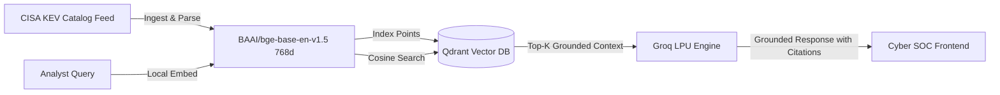

# 🛡️ CyberRAG - Neural Threat Intelligence & CVE Retrieval Engine

CyberRAG is an anti-hallucination Retrieval-Augmented Generation (RAG) platform tailored for Security Operations Centers (SOC) and cyber threat intelligence analysts. It indexes live **CISA Known Exploited Vulnerabilities (KEV)** into **Qdrant**, generates local dense vector embeddings with **BAAI/bge-base-en-v1.5**, and produces strictly grounded mitigation guidance via **Groq LPU** inference.

---

## ⚡ Core Features

- **🛡️ Strict Anti-Hallucination Guardrails:** Enforces exact bracketed CVE citations (`[Source: CVE-XXXX-XXXX]`) and refuses ungrounded remediation claims.
- **⚡ In-Memory Dense Vector Search:** Uses `BAAI/bge-base-en-v1.5` (768-dim) and `Qdrant` cosine similarity indexing.
- **🚀 Ultra-Fast Groq Inference:** Hardware-accelerated LLM generation (`openai/gpt-oss-120b` / `qwen/qwen3.8-27b`).
- **💻 Cyber SOC React Frontend:** Modern dark terminal/SOC dashboard with live similarity inspector, KEV feed search, and interactive CVE cards.
- **📡 FastAPI Backend:** In-memory cached model inference, background ingestion sync, and REST endpoints.

---

## 🏗️ Architecture Pipeline



---

## 🚀 Quick Start

### 1. Prerequisites
- **Python 3.10+**
- **Node.js 18+**
- **Docker Desktop** (for Qdrant vector database)

### 2. Start Qdrant Vector DB
```powershell
docker run -d --name qdrant-cyberrag `
  -p 6333:6333 `
  -v ${PWD}/qdrant_storage:/qdrant/storage `
  qdrant/qdrant
```

### 3. Backend Setup
```powershell
# Create & activate virtual environment
python -m venv venv
.\venv\Scripts\Activate.ps1

# Install requirements
pip install -r requirements.txt

# Configure environment variables
copy .env.example .env
# Edit .env and insert your GROQ_API_KEY

# Ingest CISA KEV data
python backend/scripts/ingest.py

# Launch FastAPI Backend
uvicorn backend.app:app --host 127.0.0.1 --port 8000
```

### 4. Frontend Setup
```powershell
cd frontend
npm install
npm run dev
```

Open [http://localhost:5173](http://localhost:5173) in your browser.

---

## 📡 API Endpoints

- `POST /api/query`: Execute vector retrieval + anti-hallucination inference.
- `GET /api/health`: Telemetry and Qdrant connection status.
- `GET /api/cves`: Search and filter indexed CVE records by vendor.
- `POST /api/sync`: Background synchronization with CISA KEV JSON.

---

## 📜 License
MIT License.
